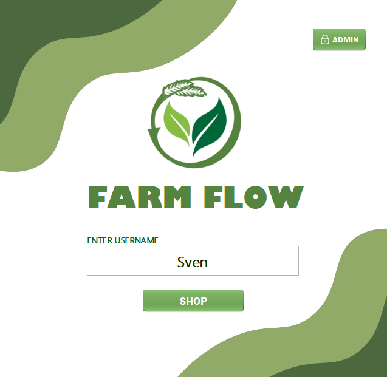
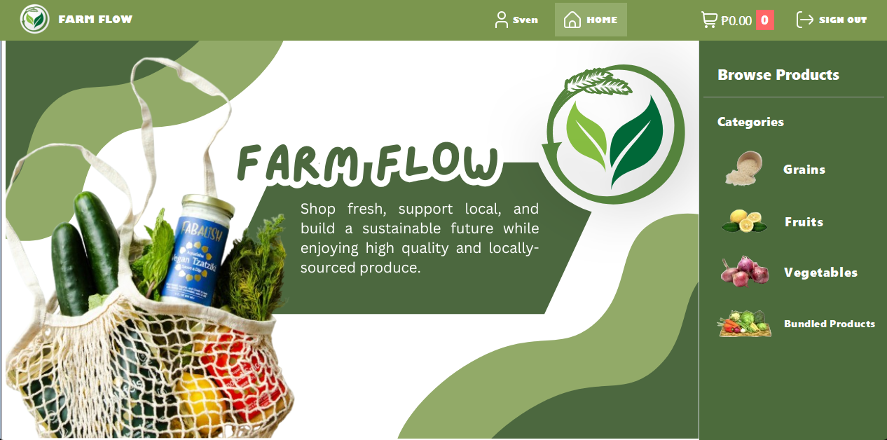
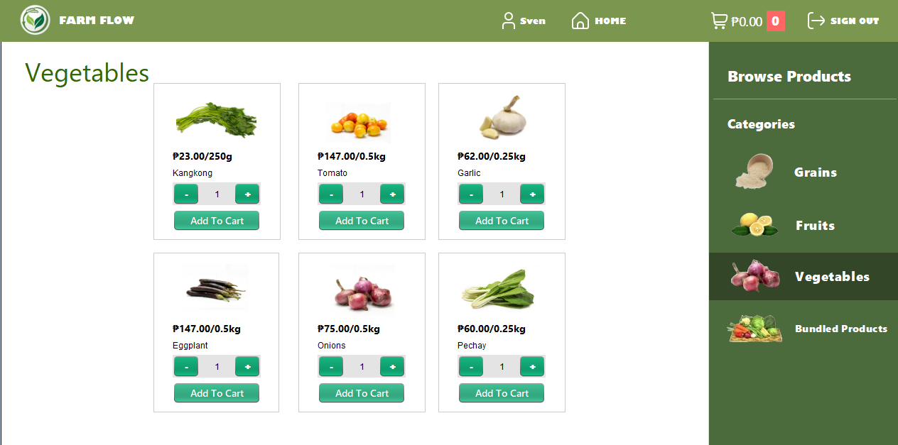
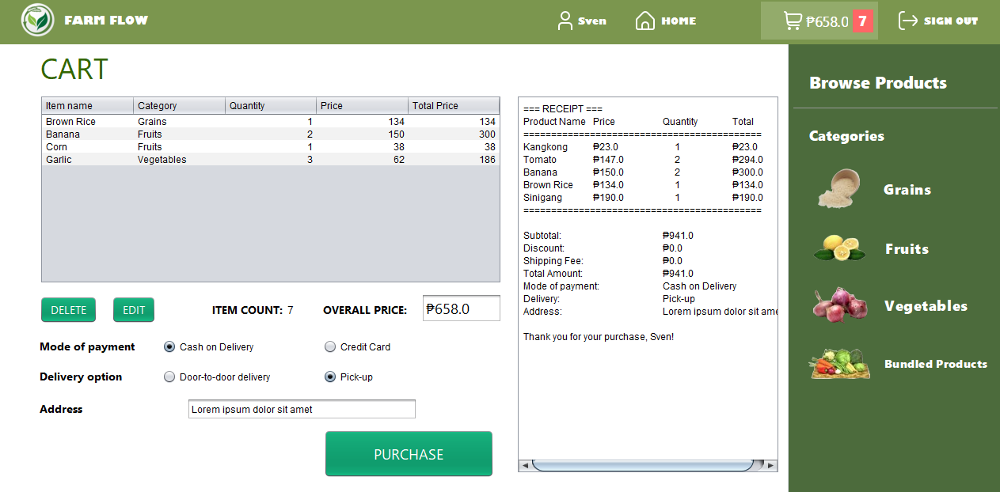
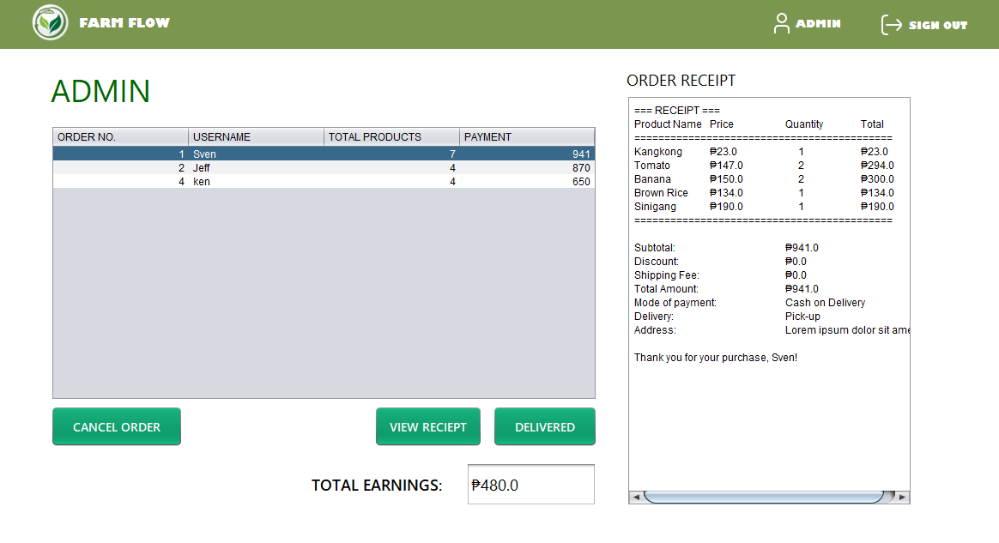

# FarmFlow
## Description
FarmFlow is my project from an Object-Oriented Programming (OOP) class in college. We were assigned to implement the four basic concepts of OOP: encapsulation, inheritance, polymorphism, and abstraction. FarmFlow is a Java POS system for the digital market of farm crops.

## Features
There are three JFrames in the application:

1. **Start Frame**: 
    - Prompts the user to enter their username.
    - Provides buttons to shop as a buyer or to access the admin frame.


2. **Buyer Frame**:
    - Allows browsing of products in categories such as grains, fruits, vegetables, and bundled products.
    - Each item has buttons to increase or decrease the product quantity.
    - Includes a button to add items to the cart, which are then listed in the cart tab.
    - The cart tab lists items in a Java table where you can manage your items.
    - Provides an option to purchase items, printing the receipt on the side.




3. **Admin Frame**:
    - Admins can view receipts in their orders table.
    - Admins have the option to cancel and deliver products.


## Installation
To install and run this project, follow these steps:

1. Clone the repository:
    ```sh
    git clone https://github.com/yourusername/FarmFlow.git
    ```
2. Open the project in NetBeans IDE.
3. Build and run the project from the IDE.

## Usage
Once the project is running, you can use the following features:

- **Start Frame**: Enter your username and choose to shop as a buyer or access the admin frame.
- **Buyer Frame**: Browse products, manage your cart, and purchase items.
- **Admin Frame**: View and manage orders, including canceling and delivering products.

## Contributing
If you would like to contribute to this project, please follow these steps:

1. Fork the repository.
2. Create a new branch (`git checkout -b feature-branch`).
3. Make your changes and commit them (`git commit -m 'Add some feature'`).
4. Push to the branch (`git push origin feature-branch`).
5. Open a pull request.
